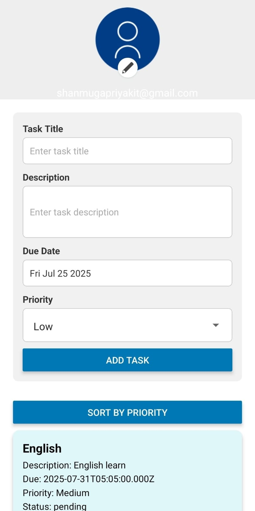

# ✅ Todo Task Management App

A cross-platform mobile app built with **React Native** to help users manage their tasks effectively with social login and offline support.

---

## 📱 Features

### 🔐 Authentication
- Local email & password authentication
- User credentials stored securely using `AsyncStorage`
- Error handling for login and registration


### 📝 Task Management
- Add, edit, update, and delete tasks (CRUD)
- Task fields:
  - Title
  - Description
  - Due Date
  - Status (Open/Completed)
  - Priority (High, Medium, Low)

### 📦 Storage
- Tasks are stored locally using `AsyncStorage`
- Tasks persist even after app restart

### 💡 UI/UX
- Clean and responsive design
- Scrollable interface with sticky header
- Task filtering by priority
- Task sorting: High → Medium → Low
- Profile section with photo editing
- Logout support

### 🚀 Enhancements
- Pull-to-refresh on task list
- Swipe to delete task
- Profile picture picker via gallery
- Smooth animations for list updates
- Mobile-optimized UI with single scrollbar support

---

## 🛠️ Tech Stack

| Layer       | Technology              |
|-------------|--------------------------|
| Frontend    | React Native (Expo)     |
| State Mgmt  | React useState & props  |
| Storage     | AsyncStorage            |
| Animations  | React Native built-ins  |

---


## 📸 App Screenshots

### 📝 Register Screen


### 🔐 Login Screen


### 📋 Task Dashboard


---

## 🧪 How to Run

1. Clone the repository  
   ```bash
   git clone https://github.com/shanmugapriya7604/todo-list-react-native-app
   cd todo-hackathon-app
